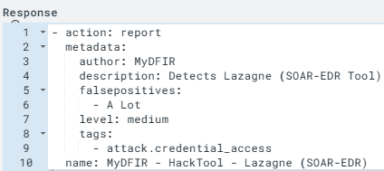
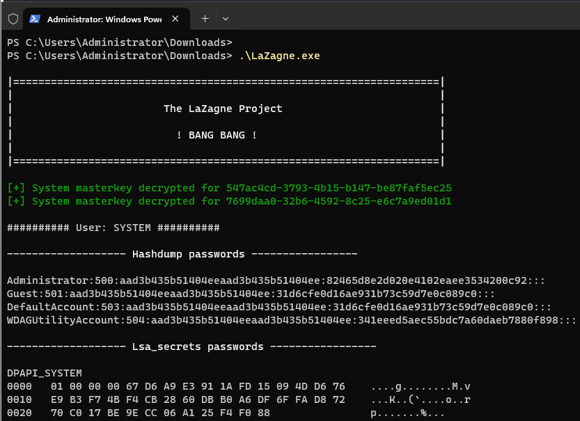
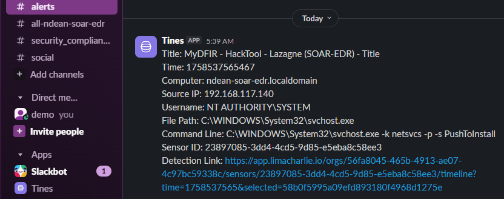
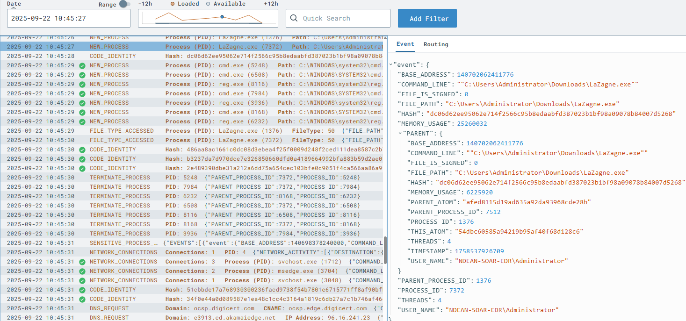
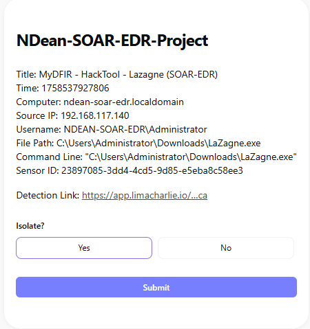
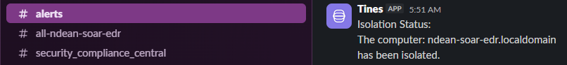
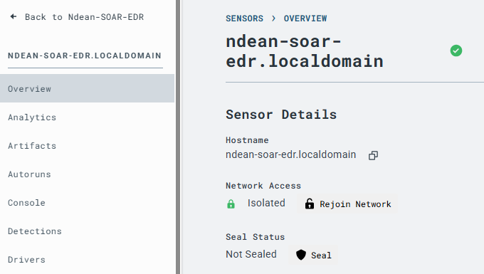

# soar-edr-incident-response
SOAR + EDR lab project using LimaCharlie and Tines to detect password recovery tools, send real-time alerts, and automate host isolation.


## Project Overview
SOAR EDR Incident Response Project demonstrates how to integrate LimaCharlie (EDR) and Tines (SOAR) to automatically detect and respond to credential dumping attempts on a Windows endpoint. It showcases real-time alerts (Slack + Email), analyst decision prompts, and automated host isolation.


## Skills Learned
- Writing custom EDR detection rules (YAML in LimaCharlie).
- Building SOAR workflows in Tines.
- Automating Slack & Email alerts.
- Integrating EDR with SOAR via APIs.
- Host isolation and containment workflows.


## Tools Used
- VMware Workstation
- Windows Server 2016
- LimaCharlie (EDR)
- Tines (SOAR)
- Slack & Email integrations
  


## Lab Architecture & Workflow
Shows how suspicious activity on the endpoint is detected, forwarded, and responded to:

1. Endpoint (Windows Server VM) → The simulated attacker runs LaZagne, a password recovery tool.
2. LimaCharlie (EDR) → Detects the suspicious process execution based on detection rules
3. Tines (SOAR) → Receives the alert from LimaCharlie through a webhook integration.
4. Slack & Email → Tines automatically notifies the SOC team in real time.
5. Analyst Decision → Tines prompts the analyst to decide whether the endpoint should be isolated.
6. Host Isolation → If approved, Tines calls the LimaCharlie API to quarantine the endpoint. A confirmation is sent back to Slack.


   
## Setup & Configuration
Deployed Windows Server VM and installed LimaCharlie agent.

- Download the appropriate Windows LimaCharlie sensor from the LC console.


- Generated an installation key in LimaCharlie.


- Installed the agent on the Windows VM using PowerShell.
 

- Verified the sensor check-in under LimaCharlie → Sensors.
  
   

- Configured Slack + Email integrations in Tines.
- Built LimaCharlie → Tines webhook connection.

## Detection Rules (LimaCharlie)
To detect suspicious credential dumping activity, I created a custom detection rule in LimaCharlie targeting the execution of LaZagne.

### Detection Logic
This rule applies to Windows endpoints and triggers on both `NEW_PROCESS` and `EXISTING_PROCESS` events.
It generates an alert if any of the following conditions are met:
- Process file path ends with `lazagne.exe`
- Command line ends with `all` (a common LaZagne execution flag)
- Command line contains the keyword lazagne
- File hash matches a known LaZagne binary

### Detection Rule (YAML)

```yaml

  events:
    - NEW_PROCESS
    - EXISTING_PROCESS
  op: and
  rules:
    - op: is
    - op: or
      rules:
        - case sensitive: false
          op: ends with
          path: event/FILE_PATH
          value: lazagne.exe
        - case sensitive: false
          op: ends with
          path: event/COMMAND_LINE
          value: all
        - case sensitive: false
          op: contains
          path: event/COMMAND_LINE
          value: lazagne
        - case sensitive: false
          op: is
          path: event/HASH
          value: dc06d62ee95062e714f2566c95b8edaabfd387023b1bf98a09078b84007d5268
```


### Detection Response

The detection is configured to generate a report with context, tagged under MITRE ATT&CK – Credential Access.

```yaml

- action: report
  metadata:
    author: MyDFIR
    description: Detects LaZagne (SOAR-EDR Tool)
    falsepositives:
      - A lot
    level: medium
    tags:
      - attack.credential_access
  name: MyDFIR - HackTool - Lazagne (SOAR-EDR)
```



## ⚡ Tines SOAR Story


This SOAR story in Tines orchestrates the automated incident response workflow. It connects LimaCharlie detections to Slack, Email, and automated host isolation.

### Workflow Steps

**1. Webhook Listener (Retrieve Detections)**
- Tines receives detection alerts from LimaCharlie through a webhook.
- Each detection contains metadata such as time, computer name, source IP, command line, file path, and sensor ID.

**2. Slack & Email Notifications**
- Tines formats the detection details and sends them to Slack and Email in real time.
- This ensures analysts are immediately aware of the suspicious activity.

**3. User Prompt (Decision Point)**
- Analysts receive a decision form in Tines asking: “Do you want to isolate this machine?”
- Provides context: host, IP, file path, detection link.

**4a. If Analyst Chooses YES**
- Tines issues an HTTP Request to the LimaCharlie API to isolate the sensor (endpoint).
- Another HTTP request retrieves the isolation status.
- Slack receives a confirmation that the host has been isolated.

**4b. If Analyst Chooses NO**
- Tines posts a message in Slack: “The computer <hostname> was not isolated, please investigate.”
- This keeps the event open for manual follow-up.


## Demonstration Timeline (Incident Response in Action)

Step-by-step sequence:

### 1. Suspicious Tool Execution (Trigger Event)
- LaZagne executed on endpoint.



### 2. Detection Raised (LimaCharlie → Tines)
- Alert generated and forwarded.
  



### 3. Analyst is provided a detection link to further investigate

 
### 4. Analyst Prompted
- Analyst receives isolation decision form.



### 5. Isolation Executed
- Endpoint quarantined, confirmation posted.



- LimaCharlie Confirms EndPoint has been isolated



## Possible Next Steps
- Add detection coverage for other credential theft tools.
- Expand SOAR workflows to include ticketing.
- Enrich alerts with MITRE ATT&CK mappings and threat intel.

## Incident Report

### Report Details
| Field            | Information                                                                 |
|------------------|------------------------------------------------------------------------------|
| **Report Title** | Suspicious Credential Dumping Tool Execution on Windows Server (LaZagne)    |
| **Date**         | 2025-09-22                                                                  |
| **Reported By**  | ndean                                                                       |
| **Severity**     | Medium                                                                      |

---

### Summary of Findings
A suspicious credential recovery tool (**LaZagne.exe**) was executed on the Windows Server endpoint `ndean-soar-edr.localdomain`. Detection was generated by **LimaCharlie EDR**, forwarded to **Tines SOAR**, and confirmed via **Slack** and **Email alerts**. Analyst decision prompted host isolation, which was successfully executed through LimaCharlie.  

---

### Investigation Timeline (UTC)
| Time (UTC)        | Event Description                                                                 |
|-------------------|-----------------------------------------------------------------------------------|
| **10:45:27**      | `LaZagne.exe` executed on the endpoint (`C:\Users\Administrator\Downloads\LaZagne.exe`) |
| **10:45:29–10:45:33** | LimaCharlie logs process creation, command line, and file hash events              |
| **10:45:35**      | Detection triggered in **LimaCharlie** → forwarded to **Tines** webhook            |
| **10:45:36–10:45:37** | **Slack and Email alerts** generated and delivered to SOC team                     |
| **10:45:40**      | Analyst prompted in **Tines** with isolation decision form                         |
| **10:45:42**      | Analyst selects **Yes** → isolation request sent to LimaCharlie API                |
| **10:45:44**      | **LimaCharlie** confirms endpoint isolated                                         |
| **10:45:45**      | **Slack message posted**: “The computer *ndean-soar-edr.localdomain* has been isolated” |

---

### Who, What, When, Where, Why, and How
| Category | Details                                                                 |
|----------|-------------------------------------------------------------------------|
| **Who**  | SYSTEM on `ndean-soar-edr.localdomain`                                  |
| **What** | Execution of **LaZagne** credential recovery tool                       |
| **When** | 2025-09-22 approx. **07:03 UTC**                                        |
| **Where**| Windows Server 2016 VM in **lab environment**                           |
| **Why**  | Simulated attacker attempting **credential access**                     |
| **How**  | Direct execution of `LaZagne.exe all` from the **Downloads directory**  |

---

### MITRE ATT&CK Techniques
| Technique | Description |
|-----------|-------------|
| [**T1003 – OS Credential Dumping**](https://attack.mitre.org/techniques/T1003/) | Stealing credentials from OS stores (LSASS, SAM, cached creds, etc.). |
| [**T1059 – Command and Scripting Interpreter**](https://attack.mitre.org/techniques/T1059/) | Use of command interpreters (PowerShell, cmd, bash, etc.) to execute commands or scripts on a host. |
| [**T1059.001 – PowerShell**](https://attack.mitre.org/techniques/T1059/001/) | Execution using PowerShell. |
| [**T1059.003 – Windows Command Shell**](https://attack.mitre.org/techniques/T1059/003/) | Execution using cmd.exe. |
| [**T1106 – Native API**](https://attack.mitre.org/techniques/T1106/) | Use of Windows APIs and platform APIs to execute actions or bypass tooling. |

---

### Impact Assessment
| Field             | Details                                                                 |
|-------------------|-------------------------------------------------------------------------|
| **Affected Asset**| Windows Server 2016 VM (lab environment)                                |
| **Risk**          | If in production, attackers could steal credentials and move laterally to escalate privileges. |

---

### Recommendations / Next Steps
- Add hash of LaZagne binary (`dc06d62ee95062e714f2566c95b8edaabfd387023b1bf98a09078b84007d5268`) to EDR blocklist.  
- Expand detection rules to include additional credential theft tools (e.g., Mimikatz).  
- Integrate workflow with ticketing for escalation.  
- Conduct awareness training on suspicious tool execution.  

---

### Attachments / Evidence
- LaZagne execution output  
- Slack and Email alerts  
- Tines analyst prompt  
- Slack isolation confirmation  
- LimaCharlie console showing endpoint isolated  

---

### Report Status
**Closed** – Host was isolated, no further malicious activity observed.  

## 📚 References
- LimaCharlie Documentation
- Tines Documentation
- @MyDFIR YouTube Walkthrough

## Conclusion
This lab showed how I was able to integrate LimaCharlie with Tines to build an automated incident response workflow. When LaZagne was executed, it was detected right away, alerts were pushed to Slack and Email, and the endpoint was isolated automatically once I approved it. The project really demonstrates how combining SOAR and EDR can cut down response times, make a SOC more efficient, and ensure responses happen consistently.


## Skills Demonstrated
- Threat detection & alerting (EDR).
- Workflow automation (SOAR).
- Incident triage & containment.
- API-driven integration.
- SOC analyst decision-making.
