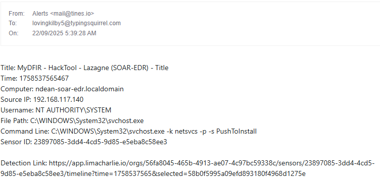

# soar-edr-incident-response
SOAR + EDR lab project using LimaCharlie and Tines to detect password recovery tools, send real-time alerts, and automate host isolation.

## 🛡️ Project Overview
SOAR EDR Incident Response Project demonstrates how to integrate LimaCharlie (EDR) and Tines (SOAR) to automatically detect and respond to credential dumping attempts on a Windows endpoint. It showcases real-time alerts (Slack + Email), analyst decision prompts, and automated host isolation.

## Skills Learned
- Writing custom EDR detection rules (YAML in LimaCharlie).
- Building SOAR workflows in Tines.
- Automating Slack & Email alerts.
- Integrating EDR with SOAR via APIs.
- Host isolation and containment workflows.

## Tools Used
- VMware Workstation
- Windows Server 2016
- LimaCharlie (EDR)
- Tines (SOAR)
- Slack & Email integrations
  


## 🖥️ Lab Architecture & Workflow

Shows how suspicious activity on the endpoint is detected, forwarded, and responded to:

1. Endpoint (Windows Server VM) → The simulated attacker runs LaZagne, a password recovery tool.
2. LimaCharlie (EDR) → Detects the suspicious process execution based on detection rules
3. Tines (SOAR) → Receives the alert from LimaCharlie through a webhook integration.
4. Slack & Email → Tines automatically notifies the SOC team in real time.
5. Analyst Decision → Tines prompts the analyst to decide whether the endpoint should be isolated.
6. Host Isolation → If approved, Tines calls the LimaCharlie API to quarantine the endpoint. A confirmation is sent back to Slack.


   
## ⚙️ Setup & Configuration

- Deployed Windows Server VM and installed LimaCharlie agent.

- Download the appropriate Windows LimaCharlie sensor from the LC console.


- Generated an installation key in LimaCharlie.


- Installed the agent on the Windows VM using PowerShell.
 

- Verified the sensor check-in under LimaCharlie → Sensors.
  
   

- Configured Slack + Email integrations in Tines.
- Built LimaCharlie → Tines webhook connection.

## 🔍 Detection Rules (LimaCharlie)
To detect suspicious credential dumping activity, I created a custom detection rule in LimaCharlie targeting the execution of LaZagne.

### Detection Logic

This rule applies to Windows endpoints and triggers on both `NEW_PROCESS` and `EXISTING_PROCESS` events.
It generates an alert if any of the following conditions are met:
- Process file path ends with `lazagne.exe`
- Command line ends with `all` (a common LaZagne execution flag)
- Command line contains the keyword lazagne
- File hash matches a known LaZagne binary

### Detection Rule (YAML)

```yaml

  events:
    - NEW_PROCESS
    - EXISTING_PROCESS
  op: and
  rules:
    - op: is
    - op: or
      rules:
        - case sensitive: false
          op: ends with
          path: event/FILE_PATH
          value: lazagne.exe
        - case sensitive: false
          op: ends with
          path: event/COMMAND_LINE
          value: all
        - case sensitive: false
          op: contains
          path: event/COMMAND_LINE
          value: lazagne
        - case sensitive: false
          op: is
          path: event/HASH
          value: dc06d62ee95062e714f2566c95b8edaabfd387023b1bf98a09078b84007d5268
```


### Detection Response

The detection is configured to generate a report with context, tagged under MITRE ATT&CK – Credential Access.

```yaml

- action: report
  metadata:
    author: MyDFIR
    description: Detects LaZagne (SOAR-EDR Tool)
    falsepositives:
      - A lot
    level: medium
    tags:
      - attack.credential_access
  name: MyDFIR - HackTool - Lazagne (SOAR-EDR)
```


## ⚡ Tines SOAR Story


This SOAR story in Tines orchestrates the automated incident response workflow. It connects LimaCharlie detections to Slack, Email, and automated host isolation.

### Workflow Steps

**1. Webhook Listener (Retrieve Detections)**
- Tines receives detection alerts from LimaCharlie through a webhook.
- Each detection contains metadata such as time, computer name, source IP, command line, file path, and sensor ID.

**2. Slack & Email Notifications**
- Tines formats the detection details and sends them to Slack and Email in real time.
- This ensures analysts are immediately aware of the suspicious activity.

**3. User Prompt (Decision Point)**
- Analysts receive a decision form in Tines asking: “Do you want to isolate this machine?”
- Provides context: host, IP, file path, detection link.

**4a. If Analyst Chooses YES**
- Tines issues an HTTP Request to the LimaCharlie API to isolate the sensor (endpoint).
- Another HTTP request retrieves the isolation status.
- Slack receives a confirmation that the host has been isolated.

**4b. If Analyst Chooses NO**
- Tines posts a message in Slack: “The computer <hostname> was not isolated, please investigate.”
- This keeps the event open for manual follow-up.


## 📸 Demonstration Timeline (Incident Response in Action)

Step-by-step sequence:

### 1. Suspicious Tool Execution (Trigger Event)
- LaZagne executed on endpoint.


### 2. Detection Raised (LimaCharlie → Tines)
- Alert generated and forwarded.
  




### 3. Analyst is provided a detection link to further investigate

 
### 4. Analyst Prompted
- Analyst receives isolation decision form.


### 5. Isolation Executed
- Endpoint quarantined, confirmation posted.


- LimaCharlie Confirms EndPoint has been isolated


## Possible Next Steps

- Add detection coverage for other credential theft tools.
- Expand SOAR workflows to include ServiceNow/Jira ticketing.
- Enrich alerts with MITRE ATT&CK mappings and threat intel.

## 📝 Report

Example: This lab demonstrated that integrating LimaCharlie with Tines provides effective automated response to credential-dumping activity. Detections flowed seamlessly into SOAR, notifications reached analysts, and automated containment reduced MTTR.

## 📚 References

LimaCharlie Documentation

Tines Documentation

@MyDFIR YouTube Walkthrough

## 🏁 Conclusion
Summarize the project’s significance.


## 🧩 Skills Demonstrated

Threat detection & alerting (EDR).

Workflow automation (SOAR).

Incident triage & containment.

API-driven integration.

SOC analyst decision-making.
